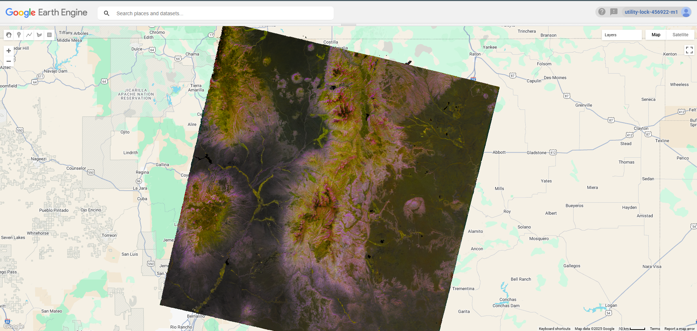
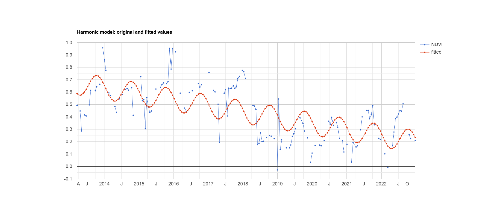

# Introduction {#intro}
About me insert text here insert text here insert text here insert text here insert text here insert text here insert text here insert text here insert text here insert text here insert text here insert text here insert text here insert text here insert text here insert text here insert text here insert text here insert text here insert text here insert text here insert text here insert text here insert text here insert text here insert text here insert text here insert text here insert text here insert text here insert text here insert text here insert text here insert text here insert text here insert text here insert text here insert text here insert text here insert text here insert text here insert text here insert text here insert text here insert text here insert text here insert text here insert text here insert text here insert text here insert text here insert text here insert text here insert text here insert text here insert text here insert text here insert text here insert text here insert text here insert text here insert text here insert text here insert text here insert text here insert text here insert text here insert text here insert text here insert text here insert text here insert text here insert text here insert text here insert text here insert text here insert text here insert text here insert text here insert text here insert text here insert text here insert text here insert text here insert text here insert text here insert text here insert text here insert text here insert text here insert text here
#### Jump to:
[Projects](#projects) | [Contact](#contact)
# Projects {#projects}
## Google Earth Engine: Remote Sensing (Javascript)
### - Process
This project, which served as my final project for a course called Applied Remote Sensing, takes a point of interest and selects from Landsat 8 & 9 imagery available at that location to conduct an analysis of NDVI (Normalized Difference Vegetation Index). The images utilized are captured over a series of time and are run through a quality control function before finally being analyized with three linear trend models.
### - Final Product
The code for the project produced three linear trend models and several visual layers, but here is the graph for the Harmonic Model (because of the cyclical nature of NDVI, a proxy for Net Primary Productivity). Shown here is an image where the RBG values are set to phase (hue), amplitude (saturation), and NDVI (value), respectively. Also shown is the Harmonic Model trend over time. 

## ArcGIS Pro: Hydrologic Analyses
In this project I was tasked with delineating a watershed as part of my Advanced GIS and Remote Sensing course. This involved using the built in watershed analysis tool in Arc GIS Pro like Flow Direction, Flow Accumulation, Wastershed and Stream Order. Part of this project was understanding data precision and accuracy, and the difference between those principles. I needed to ensure that before I began my analysis that my rasters were orthogonal and based on the same grid, as well as projected in an appropriate coordinate system. I chose a watershed in northeastern New Mexico.

## ArcGIS Pro: Raster Modeling

### Habitat Suitability (ArcPython)

### Temperature Modeling

## Data Visualization
### General Principles of Design

### Final Product
# Contact {#contact}
Main contact information here
## Resume
Put resume here
