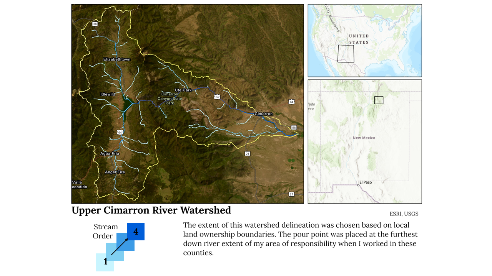
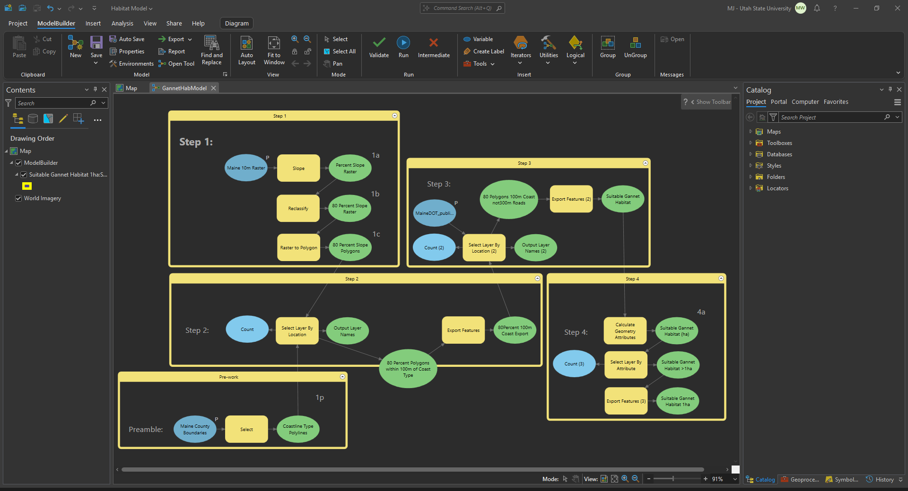

# Introduction {#intro}
Hi! This page serves as my portfolio. Here are some examples of the work that I have done in my undergrad at Utah State. I completed my B.S. in Forest Ecology & Management with a Professional Certificate in Applied Geographic Information Sciences. In my free time I like to do anything that has to do with Star Wars, the outdoors, or spending time with good people. I am currently employed by Weyerhaeuser and am stationed in Longview, WA.
#### Jump to:
[Projects](#projects) | [Contact](#contact)
# Projects {#projects}
## Google Earth Engine: Remote Sensing (Javascript)
### - Process
This project, which served as my final project for a course called Applied Remote Sensing, takes a point of interest and selects from Landsat 8 & 9 imagery available at that location to conduct an analysis of NDVI (Normalized Difference Vegetation Index). The images utilized are captured over a series of time and are run through a quality control function before finally being analyized with three linear trend models.
### - Final Product
The code for the project produced three linear trend models and several visual layers, but here is the graph for the Harmonic Model (because of the cyclical nature of NDVI, a proxy for Net Primary Productivity). Shown here is an image where the RBG values are set to phase (hue), amplitude (saturation), and NDVI (value), respectively. Also shown is the Harmonic Model trend over time. 

## ArcGIS Pro: Hydrologic Analyses
In this project I was tasked with delineating a watershed as part of my Advanced GIS and Remote Sensing course. This involved using the built in watershed analysis tool in Arc GIS Pro like Flow Direction, Flow Accumulation, Wastershed and Stream Order. Part of this project was understanding data precision and accuracy, and the difference between those principles. I needed to ensure that before I began my analysis that my rasters were orthogonal and based on the same grid, as well as projected in an appropriate coordinate system. I chose a watershed in northeastern New Mexico.

## ArcGIS Pro: Raster Modeling
### Habitat Suitability (ArcPython)
For the final project of my Python for ArcGIS class we were tasked with putting together a script or standalone tool that would accomplish some task that would be better executed by hand than with code. During my time at Utah State I had the opportunity to teach on the Introduction to Geographic Information Sciences team as an Undergraduate Teaching Fellow. Part of my responsibilities for this position were to help students complete lab assignments. Due to the introductory nature of this course many of the assignments were simple cookbook projects, but the Northern Gannet Habitat Suitability lab was assigned as a difficult task. The process of the lab includes several narrowing selections and geoprocessing tools to finally identify suitable nesting sites for the Northern Gannet in Maine.

### Temperature Modeling
The final project for my Advanced GIS and Remote Sensing class was on a topic of my choosing. I enjoy backcountry skiing, and am interested in better predicting avalanche zones and hazards based on weather conditions to be able to more safely recreate. It turned out that I was able to pull a lot of the variables together, but the computation and analysis was outside the scope of the final project for my course. So, I simplified things to see if I could accurately model a temperature surface in a mountainous area using data from several weather stations and a USGS QL1 0.5m LiDAR dataset. To make a long story short, I needed to review some statistical principles before going ahead with my analysis. My results are presented in an ESRI [StoryMap](https://storymaps.arcgis.com/stories/9fd910f4b2d0474ab434e449da29b507).

<!--## Data Visualization
### General Principles of Design

### Final Product-->
# Contact {#contact}
Email: [mrdoublewub52@gmail.com](mailto:mrdoublewub52@gmail.com)
GitHub: [MrDoubleWub](https://github.com/mrdoublewub)
## Resume
[My latest resume](genres11Feb25.pdf)
